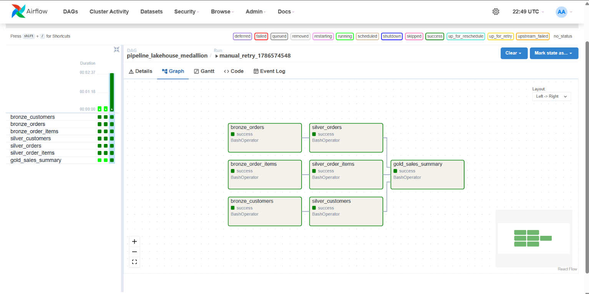
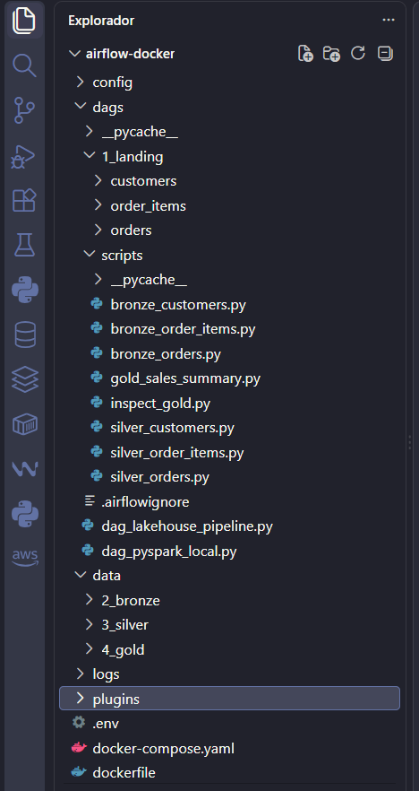
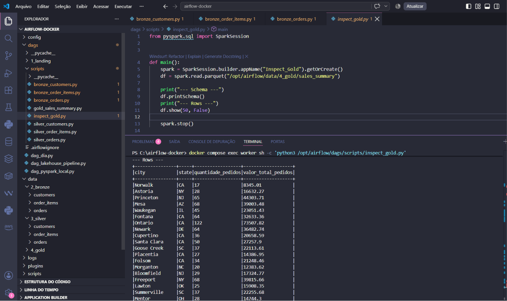

# Pipeline-Lakehouse-Medallion-com-Apache-Airflow-e-PySpark
Este projeto implementa uma pipeline de dados em arquitetura Medallion (Landing, Bronze, Silver e Gold) para processamento distribuído de dados de e-commerce. A orquestração das tarefas é realizada pelo Workflows do Apache Airflow via Docker, utilizando PySpark para ingestão, tratamento e agregação dos dados.

Arquitetura da Solução

O fluxo de dados segue o padrão de Lakehouse dividido em camadas, com base nos arquivos JSON dentro da pasta landing:

- 1_landing: Dados brutos recebidos em formato JSON (customers, orders, order_items).
- 2_bronze: Ingestão e conversão dos dados brutos para o formato colunar Parquet, garantindo consistência e persistência rápida.
- 3_silver: Padronização dos schemas, tratamento dos nomes de colunas (remoção de prefixos) e preparação para análises relacionais.
- 4_gold: Joins entre tabelas, agregação dos indicadores de negócios (quantidade de pedidos e faturamento total por cidade/estado) e persistência final.


- 
*Workflow da DAG em funcionamento no Airflow, carregando as informações das pastas e avançando por Tasks de cada script em PySpark*


## Estrutura do Projeto

```text
airflow-docker/
├── dags/
│   ├── .airflowignore
│   ├── dag_lakehouse_pipeline.py
│   ├── 1_landing/    -> Obs.: como estou utilizando o docker, a pasta landing deve estar em conjunto com as dags para processamento dos arquivos na imagem para ir
│   │   ├── customers/         em conjunto com os scripts, para funcionamento, as demais pastas podem se manter em "data", para alocação do resultado dos scripts.
│   │   ├── orders/    
│   │   └── order_items/
│   └── scripts/
│       ├── bronze_customers.py
│       ├── bronze_orders.py
│       ├── bronze_order_items.py
│   |   ├── silver_customers.py
│   |   ├── silver_orders.py
│   |   ├── silver_order_items.py
│   |   └── gold_sales_summary.py
|   |   └── inspect_gold.py  Obs.: este é um script adicional feito para visualizar o resultado final das tasks da DAG, abaixo trarei mais informações sobre. 
│   ├── .airflowignore
│   └── dag_lakehouse_pipeline.py
├── data/             -> Obs.: os arquivos processados dos scripts serão colocados nesta pasta em determinada categoria, gerando o resultado final em gold, fiz
│   ├── 2_bronze/        um script adicional para consultar os dados de gold para visualizar os dados via datalake no terminal.
│   ├── 3_silver/
│   └── 4_gold/
├── logs        -> Obs.: pastas e arquivos obrigatórios do apache airflow para configurações e acessibilidade na maquina e imagem do docker.
├── plugins     
├── .env
├── docker-compose.yaml
├── dockerfile
└── README.md
```

- 

*Utilizando o VsCode para demonstração da organização de pastas e arquivos*


Fluxo da DAG (pipeline_lakehouse_medallion)

A DAG foi configurada para executar as etapas de forma paralela entre as entidades, liberando a camada subsequente apenas após a conclusão da anterior:
- Camada Bronze: Processamento em paralelo de customers, orders e order_items, Realizando apenas transformação de JSON para Parquet.
- Camada Silver: Limpeza e renomeação de colunas executadas individualmente após cada respectiva carga Bronze. 
- Camada Gold: Criar um dataset que mostre as seguintes colunas: city, state, quantidade de pedidos e valor do pedido. Executada apenas após o término de todas as tabelas Silver, gerando o arquivo consolidado sales_summary.

Como Executar o Projeto

Pré-requisitos
- Docker Desktop instalado e em execução.
- Clonar o repositório Git.

Subir os containers do Airflow:
```
docker-compose up airflow-init
```
```
docker compose up -d --build
```
Acessar a interface Web do Airflow:

URL: http://localhost:8080
- Usuário padrão: airflow
- Senha padrão: airflow

Executar a DAG:

Na interface do Airflow, localize a DAG pipeline_lakehouse_medallion.
Ative a DAG no botão seletor.
Clique em Trigger DAG (botão de Play) para rodar o pipeline completo.

Script Complementar inspect_gold.py
- 
*Funcionamento do script complementar para visualização do datalake de dados via PySpark, visualizando o resultado final do processo da DAG*
  
Você pode só rodar o script já criado, Recomendo executar dentro do container (é o jeito mais simples e já tem Spark):

No host (PowerShell):
```text
docker compose exec worker sh -c 'python3 /opt/airflow/dags/scripts/inspect_gold.py'
```
Ou abrir um shell interativo no container e executar:
```text
docker compose exec worker sh
```
```
python3 /opt/airflow/dags/scripts/inspect_gold.py
```
Obs.: o inspect_gold.py usa Spark, então se você tentar rodar no seu Windows local precisa ter PySpark configurado, como estará junto com o contêiner dos scripts, funcionara após os comandos via terminal.

💡 Objetivo
Esse projeto foi feito para praticar integração de serviços com Docker, Apache Airflow e Spark e mostrar como é utilizar para criação de tasks e automações de tarefas, em sequência para lakehouse de forma simples.
É um exemplo leve, mas que pode ser expandido para algo maior.
